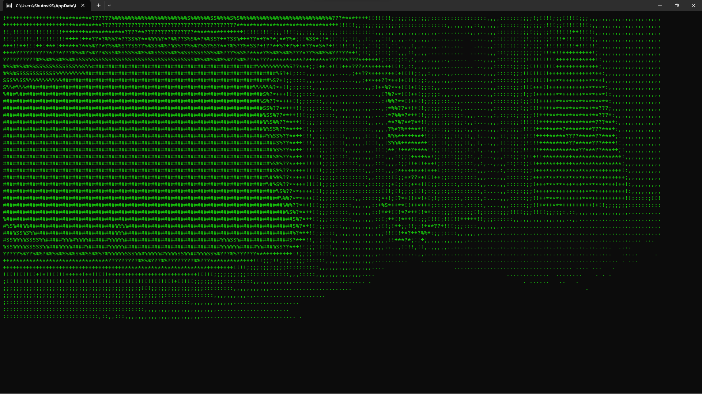
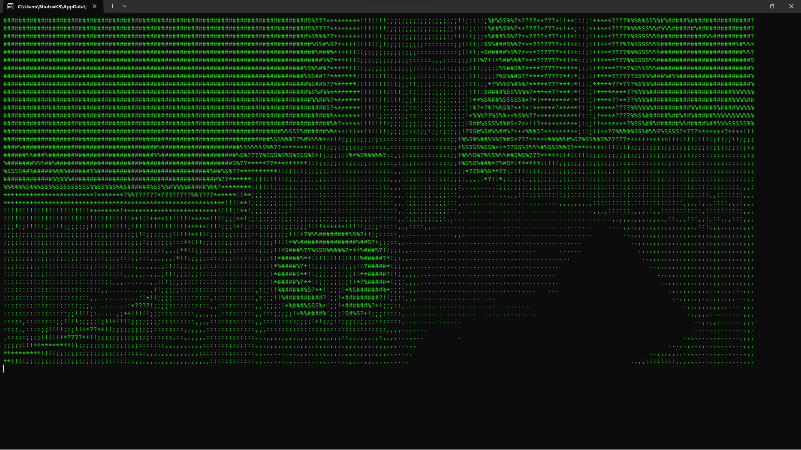

Eng | [Rus](Resources/Localization%20Readme/README_rus.md)

# Converts camera images to ASCII format.

The program accesses the first camera and, after processing, outputs the image in ASCII format to the console.

## Screenshots

