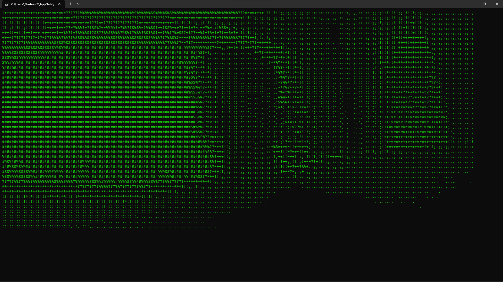
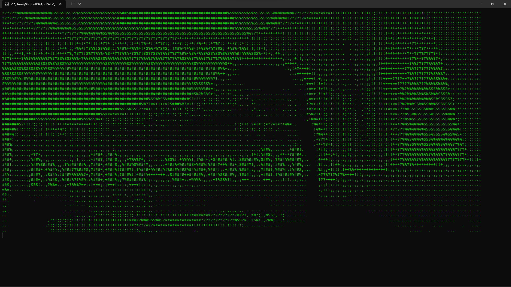

[Eng](../../README.md) | Rus

# Конвертер изображения с камеры в ASCII формат.

Программа получает доступ к первой камере и и после обработки выводит изображение в формате ASCII в консоль.

## Скриншоты

